# Evidencias del Proyecto

## 1. Secrets / Roles
*Descripción:* Capturas que muestran la gestión de secretos y roles de acceso, con valores ocultos por seguridad.

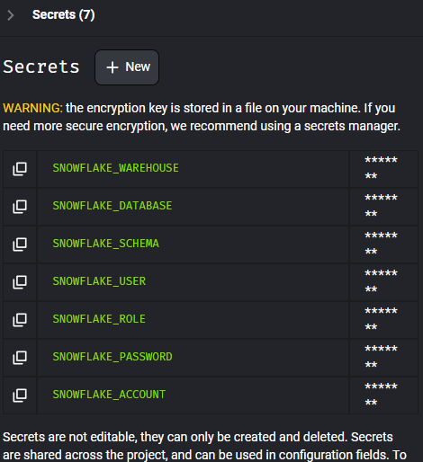

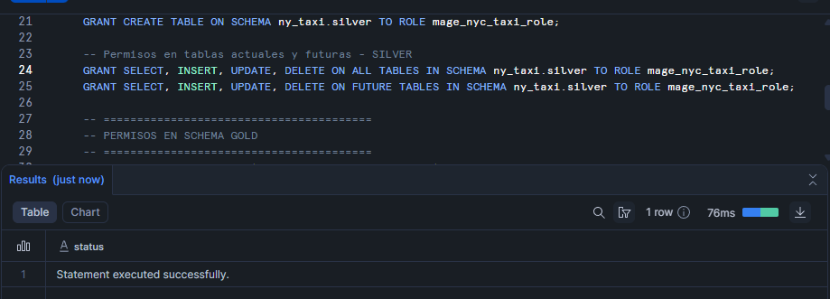
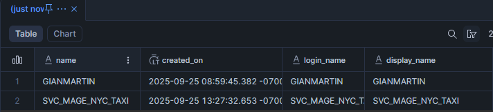
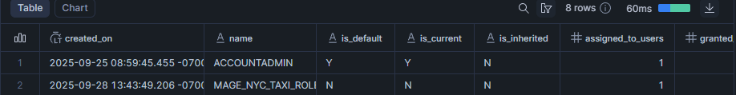
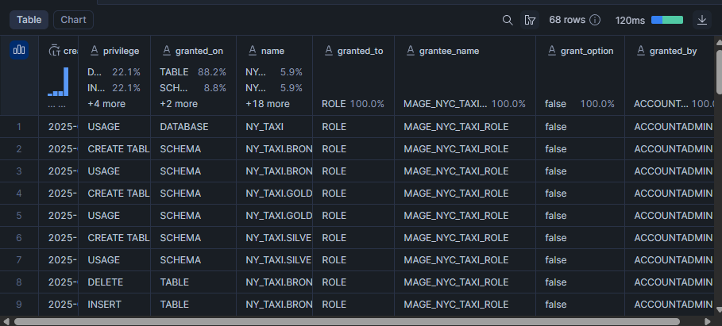
## 2. Matriz de Cobertura 
*Descripción:* Evidencia de la cobertura de tests ejecutados sobre los archivos parquet.

### Yellow Taxi

| Año  | Ene | Feb | Mar | Abr | May | Jun | Jul | Ago | Sep | Oct | Nov | Dic |
|------|-----|-----|-----|-----|-----|-----|-----|-----|-----|-----|-----|-----|
| 2015 | ✅  | ✅  | ✅  | ✅  | ✅  | ✅  | ✅  | ✅  | ✅  | ✅  | ✅  | ✅  |
| 2016 | ✅  | ✅  | ✅  | ✅  | ✅  | ✅  | ✅  | ✅  | ✅  | ✅  | ✅  | ✅  |
| 2017 | ✅  | ✅  | ✅  | ✅  | ✅  | ✅  | ✅  | ✅  | ✅  | ✅  | ✅  | ✅  |
| 2018 | ✅  | ✅  | ✅  | ✅  | ✅  | ✅  | ✅  | ✅  | ✅  | ✅  | ✅  | ✅  |
| 2019 | ✅  | ✅  | ✅  | ✅  | ✅  | ✅  | ✅  | ✅  | ✅  | ✅  | ✅  | ✅  |
| 2020 | ✅  | ✅  | ✅  | ✅  | ✅  | ✅  | ✅  | ✅  | ✅  | ✅  | ✅  | ✅  |
| 2021 | ✅  | ✅  | ✅  | ✅  | ✅  | ✅  | ✅  | ✅  | ✅  | ✅  | ✅  | ✅  |
| 2022 | ✅  | ✅  | ✅  | ✅  | ✅  | ✅  | ✅  | ✅  | ✅  | ✅  | ✅  | ✅  |
| 2023 | ✅  | ✅  | ✅  | ✅  | ✅  | ✅  | ✅  | ✅  | ✅  | ✅  | ✅  | ✅  |
| 2024 | ✅  | ✅  | ✅  | ✅  | ✅  | ✅  | ✅  | ✅  | ✅  | ✅  | ✅  | ✅  |
| 2025 | ✅  | ✅  | ✅  | ✅  | ✅  | ✅  | ✅  | ✅  | ❌  | ❌  | ❌  | ❌  |

### Green Taxi

| Año  | Ene | Feb | Mar | Abr | May | Jun | Jul | Ago | Sep | Oct | Nov | Dic |
|------|-----|-----|-----|-----|-----|-----|-----|-----|-----|-----|-----|-----|
| 2015 | ✅  | ✅  | ✅  | ✅  | ✅  | ✅  | ✅  | ✅  | ✅  | ✅  | ✅  | ✅  |
| 2016 | ✅  | ✅  | ✅  | ✅  | ✅  | ✅  | ✅  | ✅  | ✅  | ✅  | ✅  | ✅  |
| 2017 | ✅  | ✅  | ✅  | ✅  | ✅  | ✅  | ✅  | ✅  | ✅  | ✅  | ✅  | ✅  |
| 2018 | ✅  | ✅  | ✅  | ✅  | ✅  | ✅  | ✅  | ✅  | ✅  | ✅  | ✅  | ✅  |
| 2019 | ✅  | ✅  | ✅  | ✅  | ✅  | ✅  | ✅  | ✅  | ✅  | ✅  | ✅  | ✅  |
| 2020 | ✅  | ✅  | ✅  | ✅  | ✅  | ✅  | ✅  | ✅  | ✅  | ✅  | ✅  | ✅  |
| 2021 | ✅  | ✅  | ✅  | ✅  | ✅  | ✅  | ✅  | ✅  | ✅  | ✅  | ✅  | ✅  |
| 2022 | ✅  | ✅  | ✅  | ✅  | ✅  | ✅  | ✅  | ✅  | ✅  | ✅  | ✅  | ✅  |
| 2023 | ✅  | ✅  | ✅  | ✅  | ✅  | ✅  | ✅  | ✅  | ✅  | ✅  | ✅  | ✅  |
| 2024 | ✅  | ✅  | ✅  | ✅  | ✅  | ✅  | ✅  | ✅  | ✅  | ✅  | ✅  | ✅  |
| 2025 | ✅  | ✅  | ✅  | ✅  | ✅  | ✅  | ✅  | ✅  | ❌  | ❌  | ❌  | ❌  |

---

## 3. Ejecuciones en Mage AI
*Descripción:* Capturas de la ejecución de pipelines de ingesta y transformaciones.

- **Ingesta**
  
  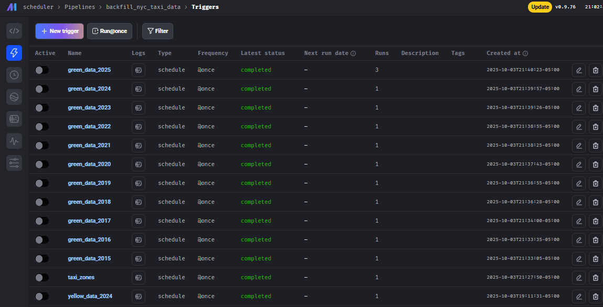
  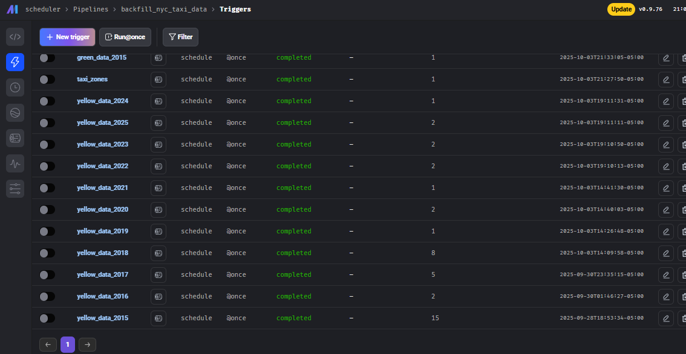

- **Lineage dbt**
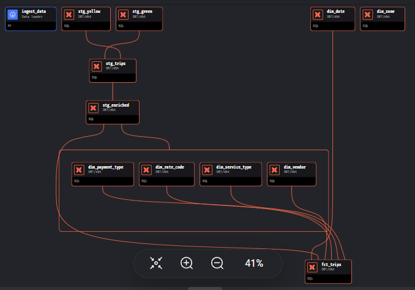

- **Salida capa silver**
 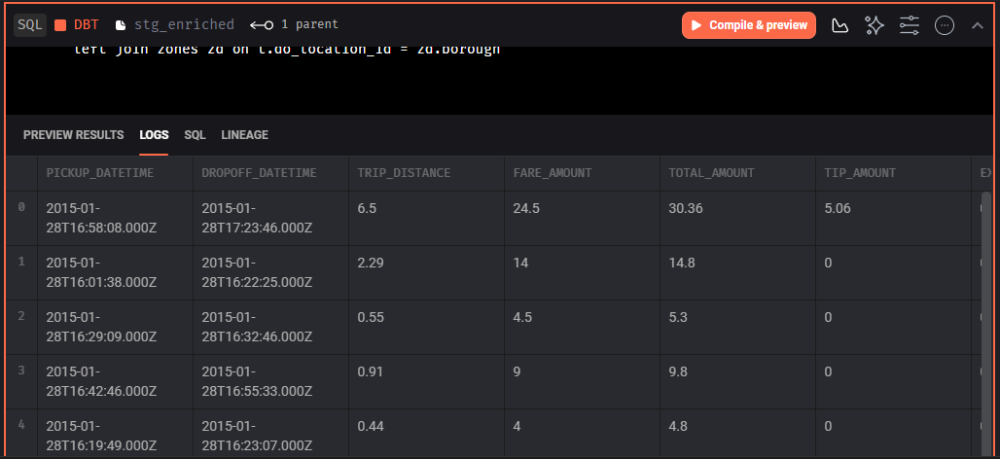

- **Salida capa gold**
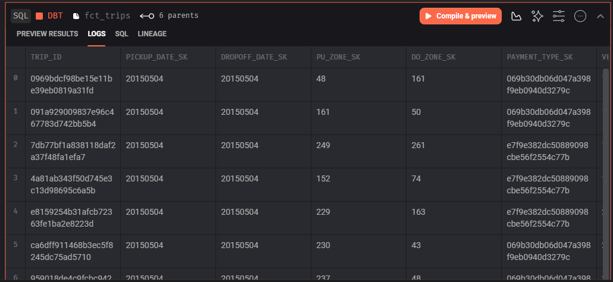

- **Tablas en snowflake**
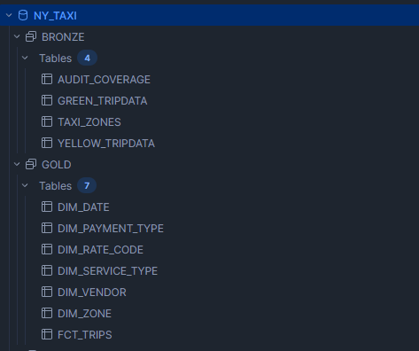
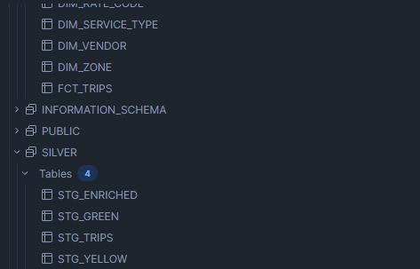

- **Query Profiles de clustering (antes/después)**
- 
### Sin clusterizar

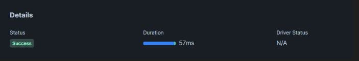
****

### Con clusterización (cluster_by=['pickup_date_sk', 'pu_zone_sk'])

En la primera ejecución de la consulta justo despues de clusterizar:

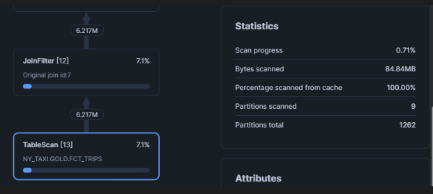

En las siguientes ejecuciones de la consulta una vez clusterizado:

