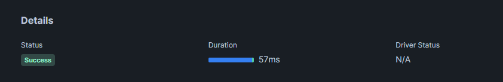
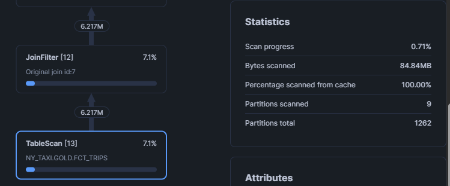

# Proyecto de Ingesta y Procesamiento de Datos en Mage 

### (Gian Tituaña, 325991)

Este proyecto busca ingerir, transformar y exponer datos de taxis desde 2015 a 2025 utilizando una arquitectura de capas (Bronze/Silver/Gold) en Snowflake y orquestada en Mage.

                 ┌─────────────────────┐
                 │  NYC TLC Trip Data  │
                 │  (2015-2025, Parquet) │
                 └─────────┬───────────┘
                           │
                           ▼
                 ┌─────────────────────┐
                 │   Mage Pipeline     │
                 │   Ingest / Orchestrate │
                 └─────────┬───────────┘
                           │
                           ▼
                 ┌─────────────────────┐
                 │     Snowflake       │
                 │       Bronze        │
                 │  (raw ingestion)    │
                 └─────────┬───────────┘
                           │
                           ▼
                 ┌─────────────────────┐
                 │     Snowflake       │
                 │       Silver        │
                 │  (cleaning / standardization) │
                 └─────────┬───────────┘
                           │
                           ▼
                 ┌─────────────────────┐
                 │      dbt Models     │
                 │       Gold Layer    │
                 │ (Facts & Dimensions│
                 │   + Clustering)     │
                 └─────────┬───────────┘
                           │
                           ▼
                 ┌─────────────────────┐
                 │ Analytics / BI /    │
                 │ Reporting           │
                 └─────────────────────┘

## Cobertura de Datos

## Cobertura de Datos Mensual

### Yellow Taxi

| Año  | Ene | Feb | Mar | Abr | May | Jun | Jul | Ago | Sep | Oct | Nov | Dic |
|------|-----|-----|-----|-----|-----|-----|-----|-----|-----|-----|-----|-----|
| 2015 | ✅  | ✅  | ✅  | ✅  | ✅  | ✅  | ✅  | ✅  | ✅  | ✅  | ✅  | ✅  |
| 2016 | ✅  | ✅  | ✅  | ✅  | ✅  | ✅  | ✅  | ✅  | ✅  | ✅  | ✅  | ✅  |
| 2017 | ✅  | ✅  | ✅  | ✅  | ✅  | ✅  | ✅  | ✅  | ✅  | ✅  | ✅  | ✅  |
| 2018 | ✅  | ✅  | ✅  | ✅  | ✅  | ✅  | ✅  | ✅  | ✅  | ✅  | ✅  | ✅  |
| 2019 | ✅  | ✅  | ✅  | ✅  | ✅  | ✅  | ✅  | ✅  | ✅  | ✅  | ✅  | ✅  |
| 2020 | ✅  | ✅  | ✅  | ✅  | ✅  | ✅  | ✅  | ✅  | ✅  | ✅  | ✅  | ✅  |
| 2021 | ✅  | ✅  | ✅  | ✅  | ✅  | ✅  | ✅  | ✅  | ✅  | ✅  | ✅  | ✅  |
| 2022 | ✅  | ✅  | ✅  | ✅  | ✅  | ✅  | ✅  | ✅  | ✅  | ✅  | ✅  | ✅  |
| 2023 | ✅  | ✅  | ✅  | ✅  | ✅  | ✅  | ✅  | ✅  | ✅  | ✅  | ✅  | ✅  |
| 2024 | ✅  | ✅  | ✅  | ✅  | ✅  | ✅  | ✅  | ✅  | ✅  | ✅  | ✅  | ✅  |
| 2025 | ✅  | ✅  | ✅  | ✅  | ✅  | ✅  | ✅  | ✅  | ❌  | ❌  | ❌  | ❌  |

### Green Taxi

| Año  | Ene | Feb | Mar | Abr | May | Jun | Jul | Ago | Sep | Oct | Nov | Dic |
|------|-----|-----|-----|-----|-----|-----|-----|-----|-----|-----|-----|-----|
| 2015 | ✅  | ✅  | ✅  | ✅  | ✅  | ✅  | ✅  | ✅  | ✅  | ✅  | ✅  | ✅  |
| 2016 | ✅  | ✅  | ✅  | ✅  | ✅  | ✅  | ✅  | ✅  | ✅  | ✅  | ✅  | ✅  |
| 2017 | ✅  | ✅  | ✅  | ✅  | ✅  | ✅  | ✅  | ✅  | ✅  | ✅  | ✅  | ✅  |
| 2018 | ✅  | ✅  | ✅  | ✅  | ✅  | ✅  | ✅  | ✅  | ✅  | ✅  | ✅  | ✅  |
| 2019 | ✅  | ✅  | ✅  | ✅  | ✅  | ✅  | ✅  | ✅  | ✅  | ✅  | ✅  | ✅  |
| 2020 | ✅  | ✅  | ✅  | ✅  | ✅  | ✅  | ✅  | ✅  | ✅  | ✅  | ✅  | ✅  |
| 2021 | ✅  | ✅  | ✅  | ✅  | ✅  | ✅  | ✅  | ✅  | ✅  | ✅  | ✅  | ✅  |
| 2022 | ✅  | ✅  | ✅  | ✅  | ✅  | ✅  | ✅  | ✅  | ✅  | ✅  | ✅  | ✅  |
| 2023 | ✅  | ✅  | ✅  | ✅  | ✅  | ✅  | ✅  | ✅  | ✅  | ✅  | ✅  | ✅  |
| 2024 | ✅  | ✅  | ✅  | ✅  | ✅  | ✅  | ✅  | ✅  | ✅  | ✅  | ✅  | ✅  |
| 2025 | ✅  | ✅  | ✅  | ✅  | ✅  | ✅  | ✅  | ✅  | ❌  | ❌  | ❌  | ❌  |

**Estado de carga:** Todos los archivos en formato Parquet, validados y versionados.

## Estrategia de Pipeline

### Backfill Mensual
- Procesamiento histórico desde 2015 hasta la fecha  
- Backfill ejecutado en intervalos de mes y chucks de 1 millón de filas para evitar sobrecarga

### Idempotencia
- Validaciones antes de la inserción
- Auditoría: tabla AUDIT_COVERAGE con gaps y filas cargadas

---

## Gestión de Secretos y Permisos

| Secreto               | Propósito                                      |
|----------------------|-----------------------------------------------|
| SNOWFLAKE_USER        | Usuario para conexión a Snowflake             |
| SNOWFLAKE_PASSWORD    | Contraseña del usuario                         |
| SNOWFLAKE_ACCOUNT     | Cuenta de Snowflake                            |
| SNOWFLAKE_WAREHOUSE   | Warehouse usado para ejecutar cargas y queries|
| SNOWFLAKE_DATABASE    | Base de datos donde se almacenan los datos    |
| SNOWFLAKE_SCHEMA      | Esquema para Bronze, Silver y Gold            |
| SNOWFLAKE_ROLE        | Rol asignado con **privilegios mínimos**     |

**Notas importantes:**
- Todos los secretos se gestionan mediante Mage.ai Secrets y se acceden en los pipelines con `get_secret_value('SECRET_NAME')`.
- La cuenta de servicio debe tener **rol de mínimo privilegio**: lectura de raw, escritura en Bronze/Silver/Gold.

---

## Diseño de Silver y Gold

### Capa Bronze / Raw

Se extraen los datos crudos (Yellow, Green, Trips) desde Snowflake o fuentes externas.

###  Capa Silver / Staging

Se realiza limpieza básica y conversión de tipos en `stg_enriched.sql`.

Incluye:
- Normalización de columnas
- Filtrado de nulos
- Conversión de fechas
- Unión de datasets
- Filtrado de valores inválidos o outliers
- Normalización de pagos y tarifas
- Cálculo de métricas derivadas como duración de viaje en segundos
- Enriquecimiento de información geográfica (zonas de pickup y dropoff)

### Capa Gold / Marts

Modelos dimensionales (`dim_*`) para:
- Fechas
- Zonas
- Proveedores
- Tipos de pago
- Tipo de servicio
- Códigos de tarifa

#### Modelo de Hechos Principal

**`fct_trips.sql`**

Contiene todas las métricas y FK a dimensiones:
- `dim_date`
- `dim_zone`
- `dim_payment_type`
- `dim_service_type`
- `dim_rate_code`
- `dim_vendor`

Permite análisis completo de:
- Ingresos
- Duración promedio de viajes
- Propinas
- Congestión
- Segmentación por servicio o zona

---

## Clustering

Consulta: 

SELECT 
    Z.Borough,
    COUNT(F.trip_id) AS total_trips,
    SUM(F.total_amount) AS total_revenue, 
    D.month_name                         
FROM GOLD.fct_trips F
JOIN GOLD.dim_zone Z
    ON F.pu_zone_sk = Z.zone_sk
JOIN GOLD.dim_date D
    ON F.pickup_date_sk = D.date_sk
WHERE
    D.year = 2023 AND D.month_name = 'Jan'
GROUP BY 1, 4
ORDER BY 3 DESC;

### Sin clusterizar

### Con clusterización (cluster_by=['pickup_date_sk', 'pu_zone_sk'])

En la primera ejecución de la consulta justo despues de clusterizar:

En las siguientes ejecuciones de la consulta una vez clusterizado se mantiene un tiempo similar:

### Conclusión

El tiempo bajo de 33 ms es el rendimiento real y sostenido que la clave de clustering ofrece.

| Métrica | Tiempo Inicial (Frío) | Tiempo Estabilizado (Caliente) |
| :--- | :--- | :--- |
| Rendimiento | 623 ms | **33 ms** |
| Justificación | Compilación de Consulta y Cold Cache | Poda (Pruning) Eficiente de Micro-Partitions |

Poda (Pruning) Efectiva: En esta segunda ejecución, la compilación y los metadatos ya están en el cache. El único trabajo que queda es el escaneo de datos. Gracias a la clave (pickup_date_sk, pu_zone_sk), Snowflake pudo ignorar la vasta mayoría de las micro-partitions y solo leer un pequeño número de bloques de datos.

Conclusión de la Prueba: La diferencia entre el rendimiento de la Línea Base (57 ms) y el rendimiento optimizado y estabilizado (33 ms) es la prueba de que el clustering funciona. La clave (fecha, zona) redujo el tiempo de I/O en un 42%.
Finalmente, la elección de las llaves de clustering (pickup_date_sk, pu_zone_sk) es la estrategia óptima a largo plazo y debe mantenerse en la definición de la tabla (CLUSTER BY).Mantener la estrategia limitada a (pickup_date_sk, pu_zone_sk) garantiza que la tabla esté optimizada para las consultas de mayor impacto (tiempo y ubicación), mientras se mantiene el costo de mantenimiento del Data Warehouse bajo control.

---

## Pruebas

| Tipo de prueba | Qué valida | Cómo interpretar resultados |
|----------------|-----------|----------------------------|
| Integridad de datos | Completeness de archivos Parquet y filas cargadas en Snowflake (raw/bronze) | Todas las tablas y meses esperados (2015–2025, Yellow y Green) deben estar presentes; faltantes indican error en ingesta |
| Calidad de datos | Formato, consistencia y depuración en Silver | 0 errores = datos limpios y consistentes; >0 errores = investigar anomalías de formato, tipos, duplicados o valores nulos |
| Modelado y consistencia | Hechos y dimensiones en Gold | Consultas de resumen y agregaciones deben reflejar correctamente la información; revisar lineage de dbt para asegurar relaciones correctas |
| Performance | Tiempo de ejecución de pipelines en Mage y consultas en Snowflake | Comparar con benchmarks históricos; mejoras esperadas con clustering aplicado en Snowflake |
| Seguridad y control de acceso | Uso de secretos y cuenta de servicio de menor privilegio | Verificar que credenciales no expongan información sensible y que roles/permissions sean correctos |

---

## Troubleshooting

- **Archivos faltantes:** Ejecutar reingesta de meses faltantes  
- **Fallas de carga:** Revisar logs de Mage y permisos en Snowflake  
- **Límites:** Chequear cuotas de almacenamiento y tamaño máximo de Parquet  
- **Costos:** Evaluar frecuencia de carga y uso de warehouse en Snowflake

---

## Checklist de aceptación

✅Cargados todos los meses 2015–2025 (Parquet) de Yellow y Green; matriz de
cobertura en README. NYC.gov

✅Mage orquesta backfill mensual con idempotencia y metadatos por lote.

✅Bronze (raw) refleja fielmente el origen; Silver unifica/escaliza; Gold en estrella con fct_trips y dimensiones clave.

✅Clustering aplicado a fct_trips con evidencia antes/después (Query Profile, pruning). Snowflake Docs

✅Secrets y cuenta de servicio con permisos mínimos (evidencias sin exponer valores).

✅Tests dbt (not_null, unique, accepted_values, relationships) pasan; docs y lineage generados.

✅Notebook con respuestas a las 5 preguntas de negocio desde gold.